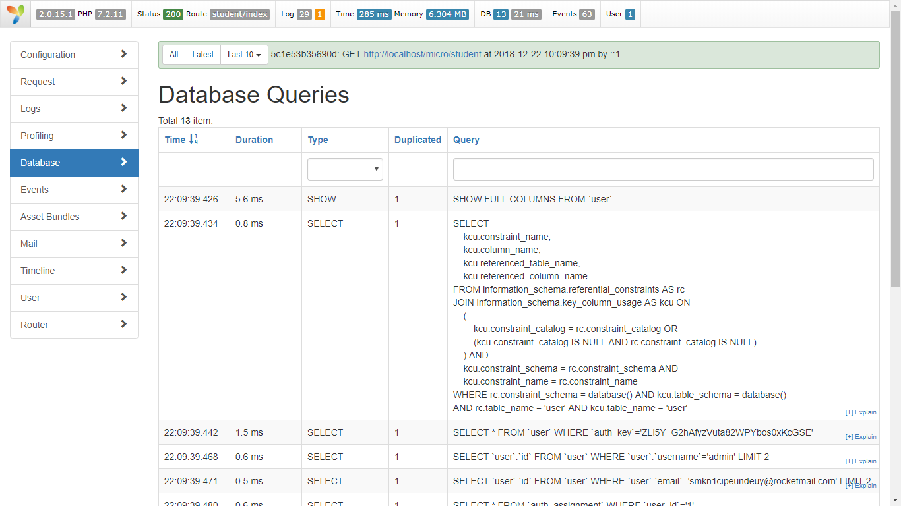

# yii2-micro-api
yii2 micro for rest api
Using Yii as a Micro-framework
Yii can be easily used without the features included in basic and advanced templates. 
In other words, Yii is already a micro-framework. It is not required to have the directory structure provided by templates to work with Yii. 

download then run composer update 

yii2-micro-api does not create database for you, you have to create yourself 

this template already include register user and login

http://localhost/yii2-micro-api/site/login - login - post  
http://localhost/yii2-micro-api/site/register - register - post

this template also include debug toolbar and gii 

you can acces gii using http://localhost/yii2-micro-api/gii  
you can acces debug using http://localhost/yii2-micro-api/debug

Auth Scenario
This template already have basic endpoint that you can use to start your REST-API. Such as:

Endpoint	Type	Usage
https://YOUR-API-URL/	            GET	list all post created
https://YOUR-API-URL/view?id={id}	GET	View a post
https://YOUR-API-URL/site/login	    POST	Login with username and password
https://YOUR-API-URL/signup	        POST	Signup with username, email and password
https://YOUR-API-URL/v1/post	    GET	List all post created
https://YOUR-API-URL/v1/post/create	POST	Create a new post (title, body)
https://YOUR-API-URL/site/user/update?id={id}	PUT / PATCH	Update a post (title, body)
https://YOUR-API-URL/v1/post/delete?id={id}	DELETE	Delete a post
https://YOUR-API-URL/v1/post/view?id={id}	GET	View a post

